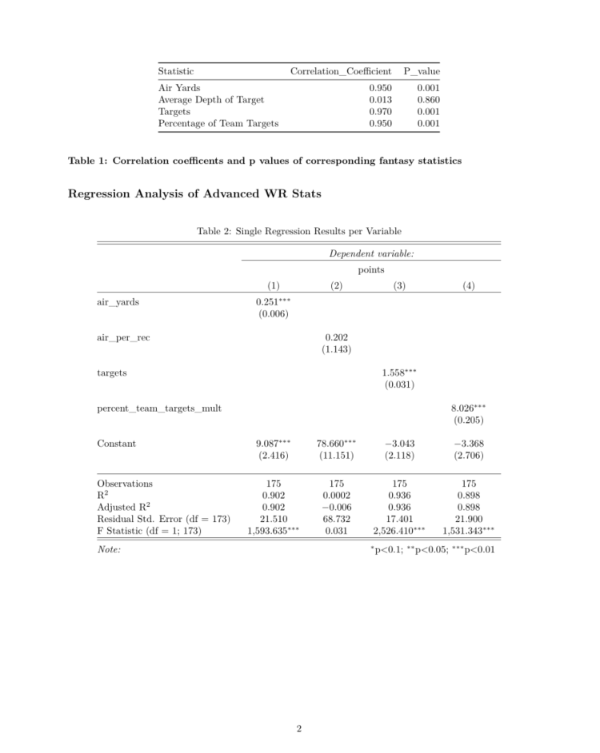

# Wide Receiver Advanced Stat Analysis

Statistical pearson correlation and regression analysis project with the goal of determining which
adavanced wide receiver statistic is most influencial for the players fantasy point
output.  

Python, SQL, and R were the tools used to scrape, clean, study, and visualize the processed
wide receiver data.  

See pdf for detailed description of findings! 

## Authors

- [@WheyGood (Matt S)](https://www.github.com/WheyGood)

## Acknowledgements

 - [Readme Editor Tool](https://readme.so/)
 - [smplot2, created by Seung Hyun Min](https://github.com/smin95/smplot2)

## Tech Stack

**Python 3.9.4**

- Pandas 1.2.5 
- re

**R** 
- ggplot2 3.36
- dplyr 1.0.10
- devtools 2.4.5
- smplot2 0.1.0
- knitr 1.42
- stargazer 5.2.3

**SQL Server Managment Studio 18**

## WR Stat Analysis Report

## SQL Query Example

