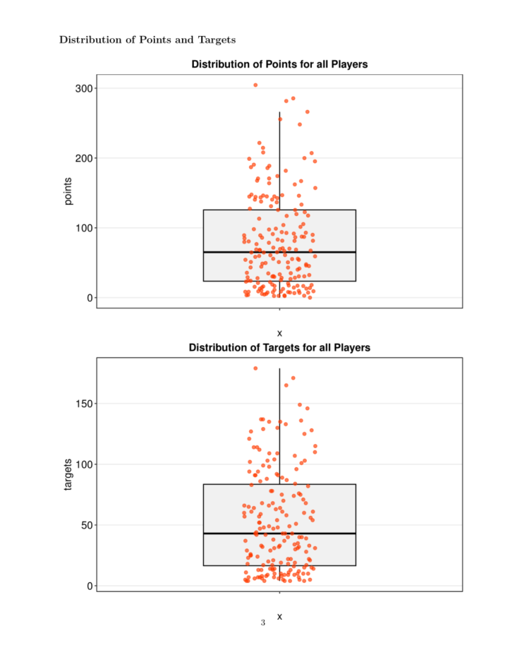

# Wide Receiver Advanced Stat Analysis

Statistical correlation and regression analysis project with the goal of determining which
adavanced wide receiver statistic is most influencial for the players fantasy point
output.  

## Authors

- [@WheyGood (Matt S)](https://www.github.com/WheyGood)

## Acknowledgements

 - [Readme Editor Tool](https://readme.so/)

## Tech Stack

**Python 3.9.4**

- Pandas 1.2.5 
- re

**R** 
- ggplot2 3.36
- dplyr 1.0.10

## WR Stat Analysis Report

